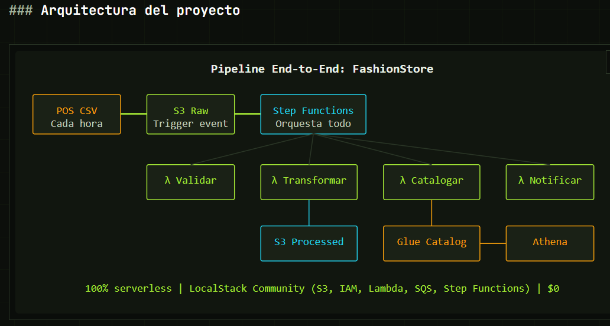

# FashionStore ETL Pipeline — Serverless en AWS

Pipeline de datos end-to-end 100% serverless, construido con LocalStack para simular AWS localmente sin coste alguno.

## Arquitectura del proyecto



Un archivo CSV de ventas llega a S3 (`raw/`) cada hora desde el sistema de punto de venta. Un evento de S3 dispara automáticamente una Lambda "dispatcher", que arranca una máquina de estados de Step Functions. Esta orquesta 4 Lambdas independientes:

1. **Validar** — comprueba que el archivo no esté vacío y sea CSV
2. **Transformar** — convierte el CSV a JSON (simulando Parquet) y lo escribe en `processed/`
3. **Catalogar** — registraría la tabla en el Data Catalog de Glue (simulado en este entorno)
4. **Notificar** — confirma que el pipeline terminó correctamente

Si la validación falla, el flujo se desvía automáticamente a un estado de notificación de error, sin romper el pipeline.

## Stack

- **S3** — data lake (zonas `raw` y `processed`)
- **IAM** — roles y policies con mínimo privilegio (cada Lambda solo tiene los permisos que necesita)
- **Lambda** — lógica de validación, transformación, catalogación y notificación
- **Step Functions** — orquestación del flujo completo, con reintentos automáticos
- **LocalStack** — emulación de AWS en local, coste: $0

## Cómo ejecutarlo

Requisitos: Docker Desktop, Python 3.10+, AWS CLI.

```bash
# 1. Levantar LocalStack
docker-compose up -d

# 2. Instalar dependencias
pip install boto3

# 3. Ejecutar el pipeline completo
python pipeline_fashionstore.py
```

El script crea toda la infraestructura (buckets, roles, Lambdas, Step Functions), sube un archivo de ejemplo, ejecuta el pipeline y verifica el resultado — todo en una sola pasada, de forma idempotente (se puede re-ejecutar sin errores).

## Notas técnicas

- El **Data Catalog de Glue** no está disponible en el plan gratuito de LocalStack; la Lambda `fs-catalogar` simula esa llamada. En producción, usaría `glue.create_table(...)` de verdad.
- Dentro de las Lambdas ejecutándose en el contenedor de LocalStack, `localhost` no apunta al host — se usa `http://localhost.localstack.cloud:4566` para que las Lambdas puedan hablar con S3/Step Functions desde dentro del propio contenedor.
- El pipeline es completamente automático: subir un `.csv` a `raw/` dispara todo el flujo sin intervención manual, gracias a la notificación de eventos de S3 conectada a la Lambda dispatcher.

## Aprendizajes

Este proyecto forma parte de mi itinerario formativo en Ingeniería de Datos (módulo Cloud AWS), donde también trabajé con Glue, Athena, EMR, Redshift y Terraform sobre este mismo pipeline.
